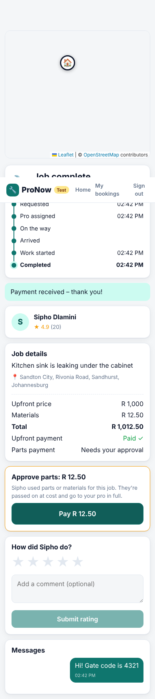
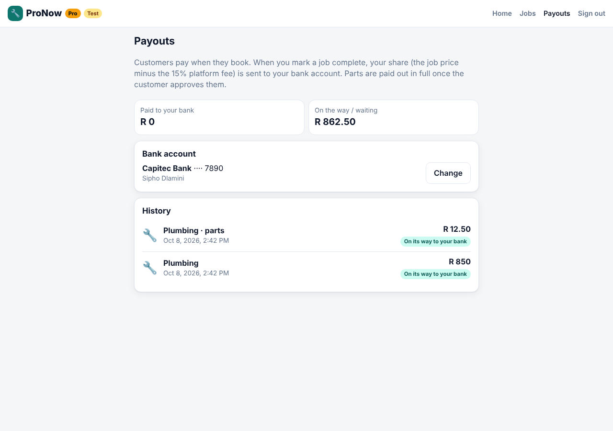

# ProNow – home services on demand

An Uber/Bolt-style marketplace for home services in South Africa: **plumbers, electricians, cleaners, locksmiths, handymen, aircon & heating, painters, appliance repair, pest control and gardeners**. Prices are in rand (ZAR).

Customers get an upfront price and pay by card through **Paystack** when they book. Nearby pros receive the request in real time, the first to accept gets the job, and the customer tracks them live on a map until the work is done and rated.

| Address search & upfront quote | Live tracking + chat | Pro dashboard |
| --- | --- | --- |
|  |  |  |

> Map tiles and address search use OpenStreetMap and work in a normal browser. They were blocked in the sandbox that took these screenshots, so a stand-in address service was used.

## Features

**Customers**
- Choose a service, **search for an address** (the pin jumps to it), tap the map or use GPS (the address fills in), describe the problem, pick job size and ASAP or a scheduled time
- Upfront price: call-out fee + hourly labour × estimated hours, with **demand-based surge** when requests outnumber available pros
- See how many pros are nearby and their ETA before booking
- Live status (requested → accepted → on the way → arrived → in progress → completed) with the pro's position moving on the map
- In-app chat and click-to-call with the assigned pro
- Pay by card with Paystack at booking. The money is held until the job is done, and cancelling before work starts refunds it in full
- Approve and pay for any parts the pro added (charged to the saved card, or via a new checkout)
- Rate and review afterwards; booking history

**Pros**
- Sign up with the services you offer, go online/offline
- New requests nearby **pop up instantly** with distance, ETA and your payout (exact address hidden until you accept)
- First pro to accept wins (atomic; others see the job disappear)
- Step through the job, add materials cost on completion, open navigation in Google Maps
- Share live GPS, or use **Demo drive** to simulate driving to the customer
- Release a job you can't make – it goes straight back to other pros
- Add a South African bank account and get paid automatically when a job is marked complete (job price minus the platform fee, plus parts in full)
- Payouts page with transfer status and a retry button for failed transfers
- Earnings for today / 7 days / all time, rating, job history

**Platform**
- Platform fee (default 15%, set with `PLATFORM_FEE_RATE`) on the upfront price; parts go 100% to the pro. Each job keeps the fee rate it was booked at
- Busy pros (with an active job) are not offered new work
- Role-based access: pros only see open requests in their categories, nobody else can read a job

## Prices

Typical 2025/26 South African rates, set in `server/src/categories.js` (amounts in cents):

| Service | Call-out | Per hour | Quick fix (1h) |
| --- | ---: | ---: | ---: |
| Plumbing | R450 | R550 | R1 000 |
| Electrical | R500 | R600 | R1 100 |
| Cleaning | R100 | R150 | R250 |
| Locksmith | R550 | R500 | R1 050 |
| Handyman | R300 | R350 | R650 |
| Aircon & Heating | R650 | R700 | R1 350 |
| Painting | R300 | R350 | R650 |
| Appliance Repair | R450 | R500 | R950 |
| Pest Control | R500 | R550 | R1 050 |
| Gardening | R150 | R180 | R330 |

Standard jobs are quoted at 2 hours and big jobs at 4. Rates differ between cities and suburbs, so check them against local competitors before launch.

## Payments (Paystack)

```
Customer books ──► Paystack checkout ──► money held in your Paystack balance
                                              │
        job goes out to pros once paid ◄──────┘
                                              │
Pro marks job complete ──► Paystack transfer to pro's bank: price − platform fee
Customer approves parts ──► saved card charged ──► transfer to pro: parts in full
Customer cancels before work starts ──► full refund
```

- Payment is confirmed with Paystack's API both when the customer returns from checkout and when the `charge.success` webhook arrives. Whichever comes first applies it, and repeats do nothing.
- If a customer manages to pay twice, or pays for a booking they already cancelled, the extra payment is refunded automatically.
- If a pro hasn't added bank details yet, or a transfer fails, the payout is kept. It's sent when they add their account or press **Retry failed** on the Payouts page.

| Customer approves parts | Pro payouts |
| --- | --- |
|  |  |

### Setting up Paystack (test mode)

1. Create a Paystack account for South Africa and copy your **test secret key** (`sk_test_…`) from *Settings → API Keys & Webhooks*.
2. Run the server with it:
   ```bash
   PAYSTACK_SECRET_KEY=sk_test_xxx APP_URL=http://localhost:5173 npm run dev
   ```
   The header shows a **Test** badge while a test key is in use.
3. Pay with one of [Paystack's test cards](https://paystack.com/docs/payments/test-payments/). No real money moves.
4. **Webhooks:** set the webhook URL to `https://<your-domain>/api/paystack/webhook`. Locally you can skip this, because payments are also confirmed when the customer returns from checkout. Transfer and refund updates do need the webhook, so use a tunnel such as `cloudflared` or `ngrok` to test those.
5. **Payouts:** pros add their bank account on the Payouts page (it creates a Paystack transfer recipient). In the Paystack dashboard:
   - make sure Transfers are enabled for your account;
   - turn off OTP for transfers, otherwise API transfers will fail with a message saying so;
   - transfers are paid from your Paystack balance, so check your settlement settings with Paystack so that collected payments stay available for payouts.

Before going live:
- Switch to your live key (`sk_live_…`).
- Paystack's own fees for card payments and transfers come out of the platform's share, so set `PLATFORM_FEE_RATE` to cover them. See [Paystack pricing](https://paystack.com/za/pricing).

## Tech stack

- **Server:** Node.js 22+, Express 5, Socket.IO, SQLite via Node's built-in `node:sqlite` (no native deps)
- **Client:** React 19, Vite, React Router, Leaflet + OpenStreetMap (no API keys)
- **Tests:** `node:test` API + realtime tests

```
server/src
  app.js         HTTP routes + Socket.IO wiring
  jobs.js        job lifecycle, dispatch, chat, earnings
  pricing.js     quotes, surge, fee split
  paystack.js    Paystack API client + webhook signature check
  payments.js    booking payments, refunds, parts, payouts
  geocoder.js    address search / reverse lookup (Nominatim), throttled + cached
  db.js          schema
  seed.js        demo accounts
client/src
  pages/         Landing, Auth, CustomerHome, ProviderHome, JobPage, History, Payouts
  components/    MapView, AddressSearch, Chat, StatusTimeline, Stars
```

## Getting started

Requires **Node.js 22.13+**.

```bash
npm install
npm run seed      # demo accounts (password: password123)
npm run dev       # API on :4000, app on http://localhost:5173
```

Demo accounts:

| Email | Role |
| --- | --- |
| customer@demo.com | Customer |
| plumber@demo.com | Plumbing, Heating & AC |
| electrician@demo.com | Electrical, Appliances |
| cleaner@demo.com | Cleaning |
| locksmith@demo.com | Locksmith, Handyman |
| handyman@demo.com | Handyman, Painting, Gardening |

**Try the full flow** (needs a Paystack test key, see below): open the app in two browser windows (one normal, one private). Sign in as `customer@demo.com` in one and `plumber@demo.com` in the other. As the pro, add a bank account on the Payouts page. As the customer, request a plumber and pay with a test card. Then accept the job as the pro, then tap *Start driving* → *Demo drive* to watch the van move on the customer's map.

### Production

```bash
npm run build     # builds the client into client/dist
npm start         # serves API + app on PORT (default 4000)
```

### Configuration

| Variable | Default | |
| --- | --- | --- |
| `PORT` | `4000` | |
| `DB_FILE` | `services.db` | SQLite file |
| `TOKEN_SECRET` | dev value | **Set this in production** |
| `CURRENCY` | `ZAR` | ISO code used for display |
| `LOCALE` | `en-ZA` | Number formatting locale |
| `PLATFORM_FEE_RATE` | `0.15` | Platform's share of the upfront price (0.15 = 15%). Applies to new bookings |
| `PAYSTACK_SECRET_KEY` | – | `sk_test_…` for test mode. Booking is disabled until set |
| `APP_URL` | `http://localhost:5173` | Public URL customers return to after checkout |
| `PAYSTACK_BASE_URL` | `https://api.paystack.co` | Only changed for tests |
| `DISPATCH_RADIUS_KM` | `30` | How far away pros get offered a job |
| `DEFAULT_LAT` / `DEFAULT_LNG` | Johannesburg | Default map centre |
| `GEOCODER_URL` | `https://nominatim.openstreetmap.org` | Any Nominatim-compatible API |
| `GEOCODER_USER_AGENT` | `ProNow/1.0 …` | **Set to your app name + contact email** (Nominatim policy) |
| `GEOCODER_COUNTRIES` | `za` | Limit address search to these countries (comma-separated, empty for all) |

Address lookups go through the server, which caches results and keeps to Nominatim's free-tier limit of one request per second. That's enough for testing and a small launch. For real traffic, self-host Nominatim or use a paid provider with a compatible API, and point `GEOCODER_URL` at it.

Service categories and prices live in `server/src/categories.js`.

### Tests

```bash
npm test
```

## Roadmap

- Cancellation fees once a pro is on the way; automatically expire unpaid bookings
- Admin console for refunds, disputes and failed payouts
- Pro verification (ID, licences, insurance) and an admin console
- Photo uploads on requests, push notifications / SMS
- Routing-based ETAs (road distance instead of straight line)
- Native apps (React Native) reusing the same API
- Postgres + PostGIS for geo queries at scale
