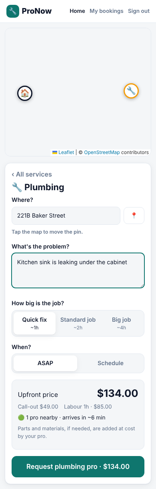
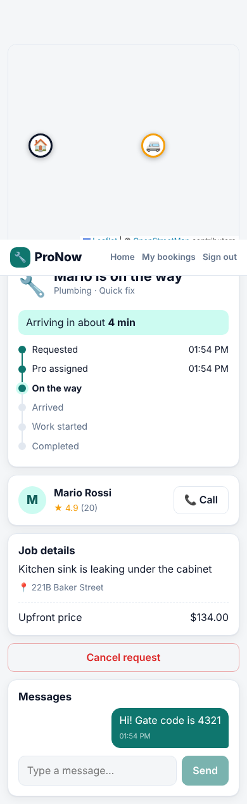
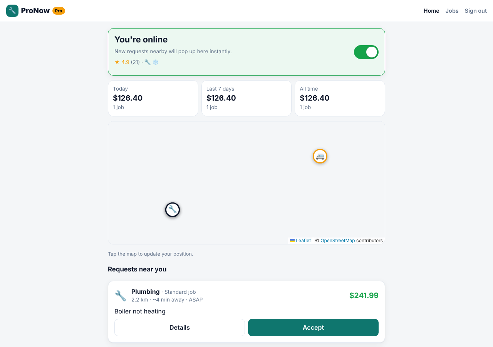

# ProNow – home services on demand

An Uber/Bolt-style marketplace for home services: **plumbers, electricians, cleaners, locksmiths, handymen, HVAC, painters, appliance repair, pest control and gardeners**.

Customers get an upfront price, nearby pros receive the request in real time, the first to accept gets the job, and the customer tracks them live on a map until the work is done and rated.

| Request & upfront quote | Live tracking + chat | Pro dashboard |
| --- | --- | --- |
|  |  |  |

> Map tiles come from OpenStreetMap and load in a normal browser (they were blocked in the sandbox that took these screenshots).

## Features

**Customers**
- Choose a service, drop a pin (or use GPS), describe the problem, pick job size and ASAP or a scheduled time
- Upfront price: call-out fee + hourly labour × estimated hours, with **demand-based surge** when requests outnumber available pros
- See how many pros are nearby and their ETA before booking
- Live status (requested → accepted → on the way → arrived → in progress → completed) with the pro's position moving on the map
- In-app chat and click-to-call with the assigned pro
- Cancel before work starts; rate and review afterwards; booking history

**Pros**
- Sign up with the services you offer, go online/offline
- New requests nearby **pop up instantly** with distance, ETA and your payout (exact address hidden until you accept)
- First pro to accept wins (atomic; others see the job disappear)
- Step through the job, add materials cost on completion, open navigation in Google Maps
- Share live GPS, or use **Demo drive** to simulate driving to the customer
- Release a job you can't make – it goes straight back to other pros
- Earnings for today / 7 days / all time, rating, job history

**Platform**
- Platform fee (default 15%) on labour; materials go 100% to the pro
- Busy pros (with an active job) are not offered new work
- Role-based access: pros only see open requests in their categories, nobody else can read a job

## Tech stack

- **Server:** Node.js 22+, Express 5, Socket.IO, SQLite via Node's built-in `node:sqlite` (no native deps)
- **Client:** React 19, Vite, React Router, Leaflet + OpenStreetMap (no API keys)
- **Tests:** `node:test` API + realtime tests

```
server/src
  app.js         HTTP routes + Socket.IO wiring
  jobs.js        job lifecycle, dispatch, chat, earnings
  pricing.js     quotes, surge, fee split
  db.js          schema
  seed.js        demo accounts
client/src
  pages/         Landing, Auth, CustomerHome, ProviderHome, JobPage, History
  components/    MapView, Chat, StatusTimeline, Stars
```

## Getting started

Requires **Node.js 22.13+**.

```bash
npm install
npm run seed      # demo accounts (password: password123)
npm run dev       # API on :4000, app on http://localhost:5173
```

Demo accounts:

| Email | Role |
| --- | --- |
| customer@demo.com | Customer |
| plumber@demo.com | Plumbing, Heating & AC |
| electrician@demo.com | Electrical, Appliances |
| cleaner@demo.com | Cleaning |
| locksmith@demo.com | Locksmith, Handyman |
| handyman@demo.com | Handyman, Painting, Gardening |

**Try the full flow:** open the app in two browser windows (one normal, one private). Sign in as `customer@demo.com` in one and `plumber@demo.com` in the other. Request a plumber as the customer and accept it as the pro, then tap *Start driving* → *Demo drive* to watch the van move on the customer's map.

### Production

```bash
npm run build     # builds the client into client/dist
npm start         # serves API + app on PORT (default 4000)
```

### Configuration

| Variable | Default | |
| --- | --- | --- |
| `PORT` | `4000` | |
| `DB_FILE` | `services.db` | SQLite file |
| `TOKEN_SECRET` | dev value | **Set this in production** |
| `CURRENCY` | `USD` | ISO code used for display |
| `PLATFORM_FEE_RATE` | `0.15` | |
| `DISPATCH_RADIUS_KM` | `30` | How far away pros get offered a job |
| `DEFAULT_LAT` / `DEFAULT_LNG` | London | Default map centre |

Service categories and prices live in `server/src/categories.js`.

### Tests

```bash
npm test
```

## Roadmap

- Payments and payouts (e.g. Stripe Connect), cancellation fees
- Pro verification (ID, licences, insurance) and an admin console
- Photo uploads on requests, push notifications / SMS
- Address search and geocoding, routing-based ETAs
- Native apps (React Native) reusing the same API
- Postgres + PostGIS for geo queries at scale
